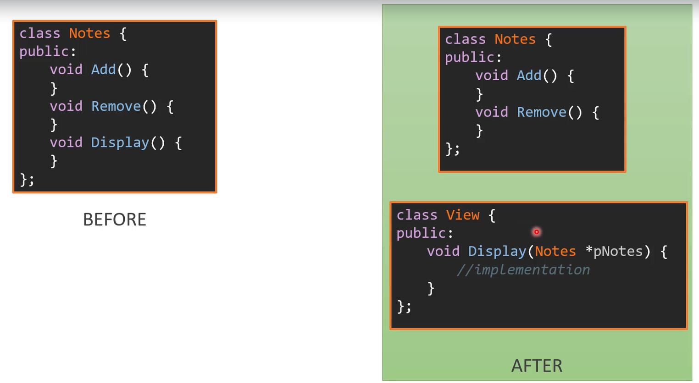
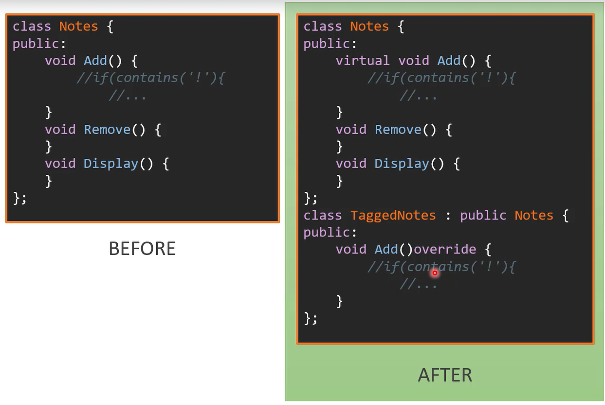

### Single Reponsibility Principle
**A class should have only one reason to change**
* Should have only one responsibility
* Classes with multiple responsibilities break when changed
* Put each responsibility in a separate class



### Open-Closed Principle
**Modules should be open for extension but closed for modification**
* Modification to existing code leads to bugs and causes the software to break
* It should be possible to change behaviour of existing code without modification.
* Instead the behavior should be changed by adding new code
* Cornerstone of good design
* Use design patterns



### Liskov-Substitution Principle
**Subtypes must be substitutable for their base types**
* Applies to inheritance relationship
* The inheritance relationship should be based on behavior
* A subclass must have all the behaviors of its base type & must not remove or change its parent behavior
* This allows a subclass to replace its base type in code 
* New subclasses can be added without modifying existing code

**Before Code:**
```Cpp
using namespace std;
class Operation {
    virtual int ResultOf(int *begin, int *end){
        //implementation specific segment and return int type
    }
};

void Operate(Operation *func){
    int arr[5];
    auto result = func->ResultOf(arr.begin(), arr.end());
    cout << result;
}
```
if we want the function return another type (boolean for example), we do not have to overwrite the base function, instead

```Cpp
using namespace std;
using ReturnType = variant<int, bool>;
struct IOperation {
    virtual ReturnType ResultOf(int *begin, int *end) = 0;
    virtual ~IOperation() = default;
};

class Operation : public IOperation {
    virtual int ResultOf(int *begin, int *end){
        //implementation specific segment and return int type
    }
};

class BoolOperation : public IOperation {
    public:
        ReturnType ResultOf(int *begin, int *end)override{
            // implementation
        }
};

void Operate(Operation *func){
    int arr[5];
    auto result = func->ResultOf(arr.begin(), arr.end());
    cout << result;
}
```

### Interface Segregation Principle
**Client should not be forced to depend on methods they do not use**
* An interface with too many methods will be complex to use (called fat interface)
* Some clients may not use all the methods, but will be forced to depend on them
* Separate the interface and put methods based on the client usage.


### Dependency Inversion Principle
**Abstractions should not depend on details. Details should depend on abstractions**
* Abstraction means an interface and details mean classes
* Using a concrete class directly creates a dependency
* Software becomes difficult to modify
* Invert the dependency by using an interface rather than a concrete class


### **Design Patterns Overview:**

Design patterns are reusable solutions to common problems in software design. They provide templates or blueprints to solve particular design challenges, promoting code maintainability, scalability, and reusability. There are three main categories of design patterns:

1. **Creational Patterns**: Deal with object creation mechanisms.
2. **Structural Patterns**: Focus on the structure of classes and objects.
3. **Behavioral Patterns**: Concern the interaction and responsibilities between objects.

### **Creational Patterns Overview:**
- **Purpose**: Manage the creation process of objects, making a system more flexible and decoupled in terms of object instantiation.
- **Advantage**: Encapsulate object creation, improve scalability, reduce tight coupling.
- **Disadvantage**: Can make code more complex if misused.

Let’s look at some important creational patterns:

---

### **1. Singleton Pattern**
#### **Purpose**:
Ensures a class has only one instance, and provides a global point of access to it.

#### **Advantages**:
- **Controlled access**: Only one instance is created.
- **Global access**: Singleton can be accessed anywhere in the program.
- **Lazy initialization**: It can be initialized when it is first needed.

#### **Disadvantages**:
- **Global state**: Can make testing and debugging harder due to its global access.
- **Tight coupling**: Many classes may become dependent on the singleton.

#### **Example**:
```cpp
class Singleton {
    static Singleton instance;
    Singleton() {}
public:
    static Singleton& getInstance() {
        return instance;
    }
};
```

#### **Use Case**:
- Logger classes
- Connection pools
- Configuration settings

---

### **2. Factory Method Pattern**
#### **Purpose**:
Defines an interface for creating an object, but lets subclasses alter the type of objects that will be created.

#### **Advantages**:
- **Promotes loose coupling**: Object creation is delegated to subclasses.
- **Flexibility**: Subclasses can determine which class to instantiate.

#### **Disadvantages**:
- **Complexity**: Increases code complexity because of extra subclasses.

#### **Example**:
```cpp
class Product {
public:
    virtual void createProduct() = 0;
};

class ConcreteProduct : public Product {
public:
    void createProduct() override {
        // Implementation of product creation
    }
};

class Creator {
public:
    virtual Product* create() = 0;
};

class ConcreteCreator : public Creator {
public:
    Product* create() override {
        return new ConcreteProduct();
    }
};
```

#### **Use Case**:
- When a class cannot anticipate the type of object it needs to create.
- When object creation logic is complex and should not be exposed.

---

### **3. Object Pool Pattern**
#### **Purpose**:
Manages a pool of objects that can be reused, avoiding the overhead of creating and destroying objects frequently.

#### **Advantages**:
- **Performance**: Reusing objects reduces object creation/destruction overhead.
- **Resource management**: Efficient for managing limited resources like connections or threads.

#### **Disadvantages**:
- **Complexity**: Managing object lifecycle and thread safety can be difficult.
- **Memory usage**: May consume more memory as unused objects remain in the pool.

#### **Example**:
```cpp
class ObjectPool {
    std::vector<Object*> pool;
public:
    Object* getObject() {
        if (pool.empty()) {
            return new Object();
        }
        return pool.back();
    }

    void releaseObject(Object* obj) {
        pool.push_back(obj);
    }
};
```

#### **Use Case**:
- Thread pools
- Database connection pools

---

### **4. Abstract Factory Pattern**
#### **Purpose**:
Provides an interface for creating families of related or dependent objects without specifying their concrete classes.

#### **Advantages**:
- **Flexibility**: Supports changing product families easily.
- **Scalability**: Can add new families without modifying existing code.

#### **Disadvantages**:
- **Complexity**: Increasing number of classes.
- **Limited flexibility**: Difficult to extend with new products.

#### **Example**:
```cpp
class AbstractFactory {
public:
    virtual ProductA* createProductA() = 0;
    virtual ProductB* createProductB() = 0;
};

class ConcreteFactory1 : public AbstractFactory {
public:
    ProductA* createProductA() override { return new ConcreteProductA1(); }
    ProductB* createProductB() override { return new ConcreteProductB1(); }
};
```

#### **Use Case**:
- When products are designed to work together and need to be created in a consistent manner.
- GUI toolkits where different look-and-feels can be selected (e.g., Windows vs MacOS).

---

### **5. Prototype Pattern**
#### **Purpose**:
Used to create new objects by copying an existing object, known as the prototype.

#### **Advantages**:
- **Efficiency**: Can create complex objects quickly by copying an existing instance.
- **Flexibility**: Allows adding and removing objects at runtime.

#### **Disadvantages**:
- **Deep vs Shallow Copy**: Managing deep copies can be complicated.
- **Cloning complexity**: If objects have complex dependencies or references.

#### **Example**:
```cpp
class Prototype {
public:
    virtual Prototype* clone() = 0;
};

class ConcretePrototype : public Prototype {
public:
    Prototype* clone() override {
        return new ConcretePrototype(*this);
    }
};
```

#### **Use Case**:
- When object creation is expensive (e.g., resource-heavy initialization).
- When system should be independent of how products are created.

---

### **6. Builder Pattern**
#### **Purpose**:
Separates the construction of a complex object from its representation, allowing the same construction process to create different representations.

#### **Advantages**:
- **Complex object creation**: Useful for creating complex objects step by step.
- **Clearer code**: Makes the creation process more readable.

#### **Disadvantages**:
- **Code complexity**: Can introduce additional complexity if overused for simple objects.

#### **Example**:
```cpp
class Product {
    string partA, partB;
public:
    void setPartA(const string& a) { partA = a; }
    void setPartB(const string& b) { partB = b; }
};

class Builder {
public:
    virtual void buildPartA() = 0;
    virtual void buildPartB() = 0;
    virtual Product* getResult() = 0;
};

class ConcreteBuilder : public Builder {
    Product* product;
public:
    void buildPartA() override { product->setPartA("A"); }
    void buildPartB() override { product->setPartB("B"); }
    Product* getResult() override { return product; }
};
```

#### **Use Case**:
- Building complex objects like houses or vehicles (where different configurations exist).
- When the construction of an object is complex and involves multiple steps.

---

### **Summary of Use Cases and Comparisons:**
- **Singleton**: Use when you need exactly one instance of a class (e.g., loggers, configuration settings).
- **Factory Method**: Use when subclasses should decide the object creation process (e.g., different parser implementations).
- **Object Pool**: Use when object creation/destruction is expensive (e.g., thread pools).
- **Abstract Factory**: Use when you want to create families of related products (e.g., GUI components for different OS).
- **Prototype**: Use when object creation is costly and new objects can be cloned (e.g., game character templates).
- **Builder**: Use when the construction process is complex (e.g., assembling cars with different configurations). 

Each pattern has its specific use cases, advantages, and disadvantages, and the choice of pattern depends on the problem you are solving.